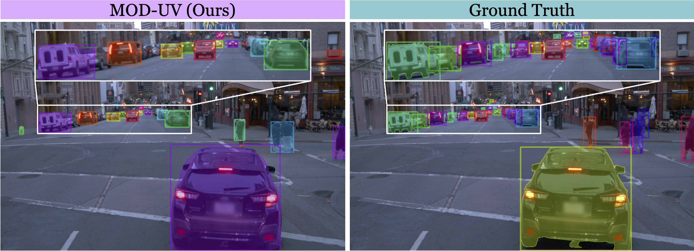

# Learning to Detect and Segment Mobile Objects from Unlabeled Videos
### [Paper](https://arxiv.org/pdf/2405.14841.pdf) | [arXiv](https://arxiv.org/abs/2405.14841)

Official PyTorch implementation for the paper: "Learning to Detect and Segment Mobile Objects from Unlabeled Videos".

  

## Code Release Coming Soon! (Before Oct. 1)
